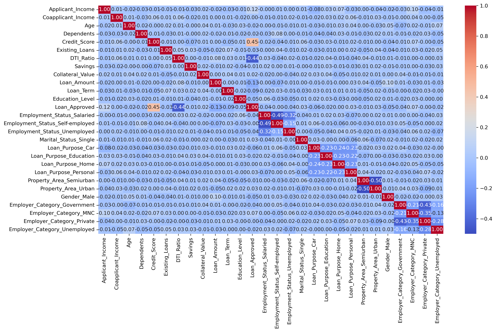

# CreditWise Loan System

> **What if banks could reduce risky loan approvals before money is ever disbursed?**  
> CreditWise Loan System is a Machine Learning project that predicts loan approval decisions using applicant financial, demographic, and employment data. The project simulates how real-world financial institutions automate risk analysis, credit screening, and approval workflows using data-driven intelligence.

---

# Overview

CreditWise Loan System is an end-to-end Machine Learning pipeline built to analyze loan applicant data and predict whether a loan should be approved or rejected.

The project focuses on:

- Real-world financial risk analysis
- Loan approval prediction
- Data preprocessing and cleaning
- Exploratory Data Analysis (EDA)
- Feature engineering
- Correlation analysis
- Model training and evaluation
- Performance comparison between multiple ML algorithms

This project demonstrates how Machine Learning can help banks and financial institutions:

- Reduce default risk
- Speed up loan approval decisions
- Automate manual verification processes
- Improve credit evaluation accuracy
- Detect high-risk applicants earlier

---

# Real-World Problem Statement

Traditional loan approval systems often involve:

- Manual verification
- Human bias
- Slow approval processes
- Inconsistent risk analysis
- Higher probability of bad loans

CreditWise Loan System solves this by building a predictive ML system that learns patterns from historical loan data and predicts whether an applicant is likely to receive loan approval.

---

# Dataset Features

The dataset contains financial, demographic, and employment-related information about applicants.

## Features Used

- Applicant Income
- Coapplicant Income
- Age
- Dependents
- Credit Score
- Existing Loans
- DTI Ratio
- Savings
- Collateral Value
- Loan Amount
- Loan Term
- Education Level
- Employment Status
- Marital Status
- Loan Purpose
- Property Area
- Gender
- Employer Category
- Loan Approved (Target Variable)

---

# Complete Workflow

## 1. Data Loading

The dataset was imported using Pandas and inspected using:

- `head()`
- `info()`
- `describe()`
- `isnull().sum()`

This helped identify:

- Missing values
- Feature data types
- Distribution of data
- Statistical properties

---

## 2. Handling Missing Values

Real-world datasets are rarely clean.

To make the dataset production-ready:

### Numerical Columns
Missing values were handled using:

```python
SimpleImputer(strategy="mean")
```

### Categorical Columns
Missing values were handled using:

```python
SimpleImputer(strategy="most_frequent")
```

This ensured:

- No null values remained
- Models could train properly
- Dataset consistency improved

---

## 3. Exploratory Data Analysis (EDA)

Extensive EDA was performed to understand hidden patterns and relationships.

## Visualizations Used

### Class Distribution
- Pie chart for approved vs rejected loans

### Income Analysis
- Histograms for applicant income
- Histograms for coapplicant income

### Outlier Detection
- Boxplots for:
  - Applicant Income
  - Credit Score
  - DTI Ratio
  - Loan Amount

### Approval Trend Analysis
- Histograms with `Loan_Approved` hue
- Comparative distribution analysis

### Feature Relationship Analysis
- Correlation Heatmap

The EDA phase helped identify:

- Financial patterns affecting approvals
- Outliers
- Feature distributions
- Strong positive and negative correlations
- High-risk financial indicators

---

## Correlation Heatmap



---

## 4. Data Cleaning

The unnecessary feature:

```python
Applicant_ID
```

was removed because it does not contribute to prediction accuracy.

---

## 5. Feature Encoding

Machine Learning models cannot directly understand categorical text data.

### Label Encoding
Used for:

- Education_Level
- Loan_Approved

### One-Hot Encoding
Applied to:

- Employment_Status
- Marital_Status
- Loan_Purpose
- Property_Area
- Gender
- Employer_Category

This transformed categorical values into machine-readable numerical format.

---

## 6. Correlation Analysis

A detailed correlation heatmap was generated using Seaborn.

### Key Insights

- Credit Score showed strong positive relation with loan approval
- DTI Ratio showed negative correlation with approval
- Financial stability indicators strongly influenced predictions

This step helped identify:

- Important features
- Weak features
- Redundant relationships
- Risk-driving variables

---

## 7. Train-Test Split

The dataset was divided into:

- 80% Training Data
- 20% Testing Data

Using:

```python
train_test_split(test_size=0.2, random_state=42)
```

This ensured unbiased model evaluation.

---

## 8. Feature Scaling

Standardization was applied using:

```python
StandardScaler()
```

Scaling was important because algorithms like:

- KNN
- Logistic Regression

perform better when features are normalized.

---

# Machine Learning Models Used

## Logistic Regression

Used for:

- Binary classification
- Probabilistic prediction
- Interpretable decision boundaries

### Evaluation Metrics
- Accuracy
- Precision
- Recall
- F1 Score

---

## K-Nearest Neighbors (KNN)

Used for:

- Similarity-based classification
- Pattern recognition
- Distance-based prediction

### Evaluation Metrics
- Precision
- Recall
- F1 Score

---

## Gaussian Naive Bayes

Used for:

- Fast probabilistic classification
- High-speed predictions
- Independent feature assumption

### Evaluation Metrics
- Precision
- Recall
- F1 Score

---

# Best Model Selection

After evaluation and comparison:

## Best Performing Model

### Gaussian Naive Bayes

The model achieved the best precision among tested algorithms.

This makes it useful for:

- Financial approval systems
- Risk-sensitive prediction tasks
- Fast classification pipelines

---

# Feature Engineering

Additional engineered features were created to improve predictive power.

## Engineered Features

### Squared DTI Ratio

```python
DTI_Ratio_sq = DTI_Ratio ** 2
```

### Squared Credit Score

```python
Credit_Score_sq = Credit_Score ** 2
```

Feature engineering helped capture:

- Non-linear relationships
- Hidden financial risk patterns
- Complex interactions between variables

The models were retrained after feature engineering for performance improvement.

---

# Technologies Used

## Programming Language
- Python

## Libraries
- Pandas
- NumPy
- Matplotlib
- Seaborn
- Scikit-learn

---

# Machine Learning Concepts Applied

- Data Cleaning
- Missing Value Imputation
- Exploratory Data Analysis
- Feature Encoding
- Correlation Analysis
- Feature Scaling
- Feature Engineering
- Classification Algorithms
- Model Evaluation
- Performance Comparison

---

# Real-World Applications

## Banking Systems
Banks can automate initial loan screening using predictive ML systems.

## FinTech Platforms
Digital lending companies can reduce manual verification efforts.

## Credit Risk Analysis
Financial institutions can identify risky applicants earlier.

## Insurance Industry
Similar models can predict insurance claim risks.

## Financial Recommendation Systems
Can assist in personalized financial product recommendations.

---

# Project Structure

```bash
CREDITWISE-LOAN-SYSTEM/
│
├── credit_wise.ipynb
├── loan_approval_data.csv
├── graph.png
├── README.md
```

---

# Conclusion

CreditWise Loan System demonstrates how Machine Learning can transform traditional financial decision-making into a faster, scalable, and data-driven process.

Instead of relying entirely on manual review, institutions can use predictive analytics to:

- Improve efficiency
- Reduce human bias
- Minimize financial risk
- Increase approval consistency
- Make smarter lending decisions

This project represents a practical implementation of classification algorithms in the financial technology domain.

---
